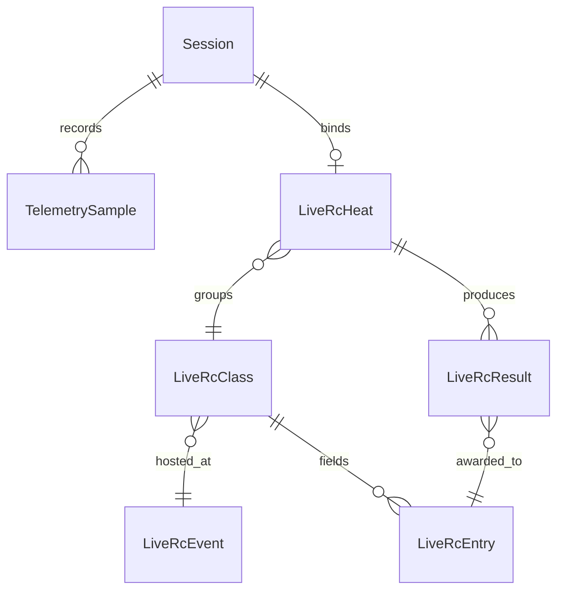

# The RC Racing Engineer — Domain Model (Draft)

This document is the source of truth for entities, relations, and invariants. PRs that change the model must update this document and follow the **Model Change Protocol** in `AGENTS.md`.

## Implemented entities (v0.2)
- **Session** — lifecycle container for telemetry, optionally linked to a LiveRC heat. Key attributes: `id`, `name`, `kind`,
  `status`, `scheduledStart`, `scheduledEnd`, `actualStart`, `actualEnd`, `timingProvider`, `liveRcHeatId`, timestamps.
- **TelemetrySample** — raw time-series capture for the control tower. Attributes: `id`, `sessionId`, `recordedAt`,
  `speedKph`, `throttlePct`, `brakePct`, `rpm`, `gear`, `createdAt`.
- **LiveRcEvent/Class/Heat** — metadata mirrors the LiveRC hierarchy so sessions can bind to authoritative heats. Key
  invariants: external ids unique per scope, schedules respect parent event ranges.
- **LiveRcEntry/Result** — roster and finishing data for heat reporting (ingestion stubs only).

### Entity relationship diagram

### Future entities (roadmap)
- **Team**, **User**, **Driver**, **Car**, **Track**, **Lap**, **Stint**, **SetupSheet**, **WeatherSnapshot**, **TyreSet**,
  **Incident**, **Annotation** — defined in the long-term model but not yet implemented. Each addition must update this document
  per the Model Change Protocol.

## Attributes & invariants
- **Session**: `id`, `name`, `description?`, `kind`, `status`, `scheduledStart?`, `scheduledEnd?`, `actualStart?`, `actualEnd?`,
  `timingProvider`, `liveRcHeatId?`, `createdAt`, `updatedAt`. *Invariants*: `scheduledEnd` ≥ `scheduledStart` when present;
  `timingProvider = LIVE_RC` requires `liveRcHeatId`.
- **TelemetrySample**: `id`, `sessionId`, `recordedAt`, `speedKph?`, `throttlePct?`, `brakePct?`, `rpm?`, `gear?`, `createdAt`.
  *Invariants*: validation schema clamps `speedKph` to ≤450, throttle/brake 0–100, RPM ≤30k, gear between -1 and 12.
- **LiveRcEvent**: `id`, `externalEventId`, `title`, `trackName?`, `facility?`, `city?`, `region?`, `country?`, `timeZone?`,
  `startTime?`, `endTime?`, `website?`, `createdAt`, `updatedAt`. *Invariant*: `externalEventId` unique; `startTime ≤ endTime`.
- **LiveRcClass**: `id`, `eventId`, `externalClassId`, `name`, `description?`, timestamps. *Invariant*: `(eventId, externalClassId)`
  unique.
- **LiveRcHeat**: `id`, `classId`, `externalHeatId`, `label`, `round?`, `attempt?`, `scheduledStart?`, `durationSeconds?`,
  `status?`, `liveStreamUrl?`, timestamps. *Invariant*: `(classId, externalHeatId)` unique; schedule contained in parent event.
- **LiveRcEntry**: `id`, `classId`, `externalEntryId`, `driverName`, `carNumber?`, `transponder?`, `vehicle?`, `sponsor?`,
  `hometownCity?`, `hometownRegion?`, timestamps. *Invariant*: `(classId, externalEntryId)` unique.
- **LiveRcResult**: `id`, `heatId`, `entryId`, `externalResultId`, `finishPosition?`, `lapsCompleted?`, `totalTimeMs?`,
  `fastLapMs?`, `intervalMs?`, `status?`, timestamps. *Invariant*: `(heatId, entryId)` unique; `finishPosition` positive when
  present.
- **Future entities** retain the invariants listed in the original draft and will be formalised alongside their implementations.

## Derived views & aggregates
- **Session summary**: per car, aggregate fastest lap, stint average pace, total pit time, tyre usage.
- **Driver comparison**: aligned telemetry for two drivers (speed, throttle, brake, rpm, gear) with delta trace.
- **Strategy view**: timeline of stints, tyre sets, fuel usage, weather overlays.
- **Reliability dashboard**: aggregated alerts (engine temps, brake fade, ERS state) with thresholds and last-occurrence times.

## Domain events
- `SessionScheduled`, `SessionStarted`, `SessionPaused`, `SessionResumed`, `SessionCompleted`
- `StintStarted`, `StintCompleted`
- `LapCompleted`
- `TelemetryIngested`
- `IncidentLogged`
- `AnnotationAdded`
- `SetupUpdated`

## Open questions
1. Do we support multiple teams per deployment or assume single-team SaaS? Impacts auth scopes.
2. How to model shared cars (e.g., endurance) where multiple drivers share same stint? Possibly allow `driverId` array per stint.
3. Telemetry volume: do we store raw Hz-level data or downsample for analytics? Storage + query strategy open.
4. Need to clarify integration with external timing providers for authoritative lap/sector data.

## Next steps
- Produce ERD diagram with finalized attributes (use Prisma schema once available).
- Define API contracts in `docs/api/` for core operations (session list, telemetry fetch, annotations CRUD).
- Establish validation schemas (Zod) for telemetry ingestion pipeline.
- Align design tokens referenced in `docs/design-principles.md` with actual implementation in web layer.
